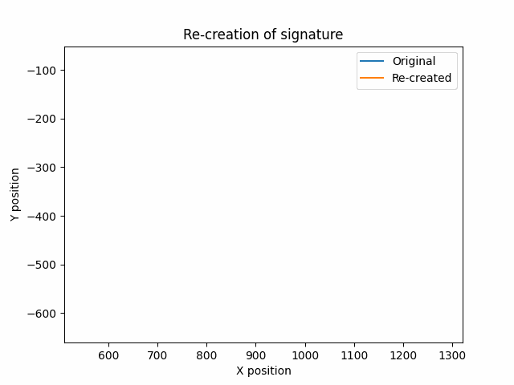
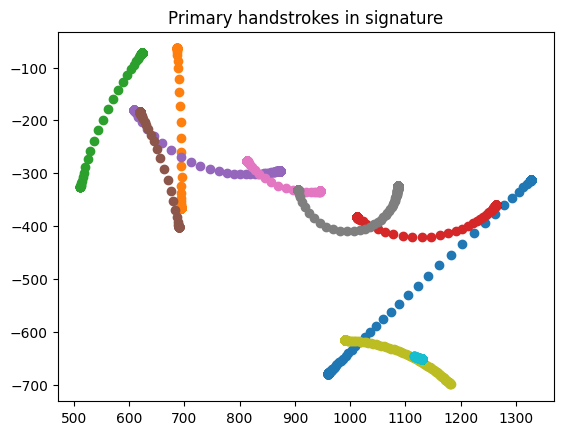

# A model of human handwriting

This project is the first public implementation of the [sigma-lognormal model](https://ieeexplore.ieee.org/document/7333769) described by Daniel Martín-Albo.

The sigma-lognormal model is a mathematical model which accurately and elegantly describes human handwriting.

It posits that handwriting and mouse movements are composed of a series of a few overlapping handstrokes, which are simple circular arcs with the following speed profile:


This repository implements a "sigma lognormal handstroke extractor" for human handwriting--it breaks down a piece of handwriting into a few handstrokes.


Example of the extractor in action:





# Usage

## Installation

```bash
pip install -r requirements.txt
```

## Running

Run the Jupyter Notebook [`demo.ipynb`](./demo.ipynb).

# To-Do

- [x] Make unified plotting/animation API.
- [x] Decrease drift on a battery of signatures.
- [ ] Add web reconstruction interface
- [x] Use PyTorch to fine-tune extracted parameters with gradient descent.
- [ ] Add mouse movement-specific extractor.
- [ ] Possibly add a `ghost-cursor`-style mouse movement generator.

# Thanks

Many thanks to Daniel Martín-Albo's amazing line of work on the sigma-lognormal model. I implemented [this](https://ieeexplore.ieee.org/document/7333769), but he has also investigated mouse cursor intent analysis [here](https://dl.acm.org/doi/10.1016/j.ipm.2016.04.005), and his work has led to a fascinating bot detection approach [here](https://arxiv.org/abs/2005.00890).
