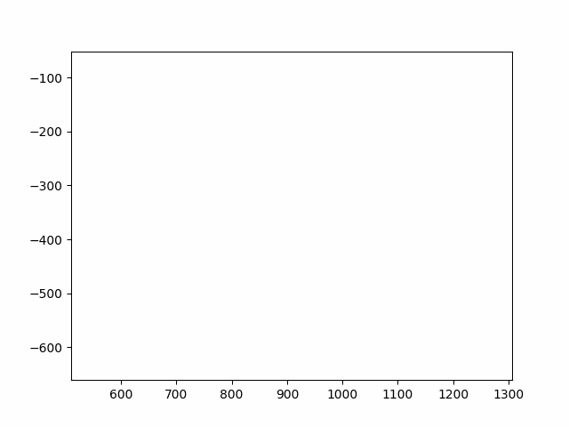

# Sigma-lognormal Model

The sigma-lognormal model is a mathematical model describing fast human muscle twitches.

This repository implements a sigma lognormal parameter extractor for human handwriting, and eventually mouse movement.

You can find the papers on which this implementation is based in the `papers` folder, with annotations.



# Usage

## Installation

```bash
pip install -r requirements.txt
```

## Running

The web demo is still in progress. For now, you can use the Jupyter Notebook `debug.ipynb` and run all cells.

# To-Do

- [x] Make unified plotting/animation API.
- [ ] Decrease drift on a battery of signatures.
- [ ] Add web reconstruction interface
- [ ] Use PyTorch to fine-tune extracted parameters with gradient descent.
- [ ] Add mouse movement-specific extractor.
- [ ] Possibly add a `ghost-cursor`-style mouse movement generator.